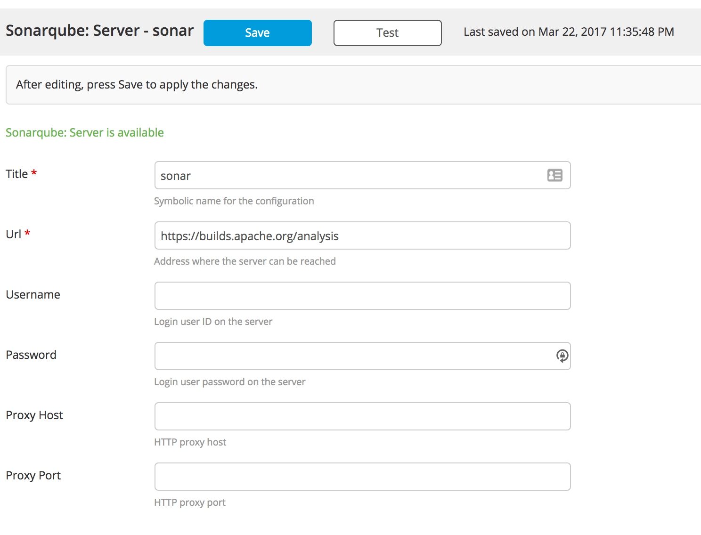
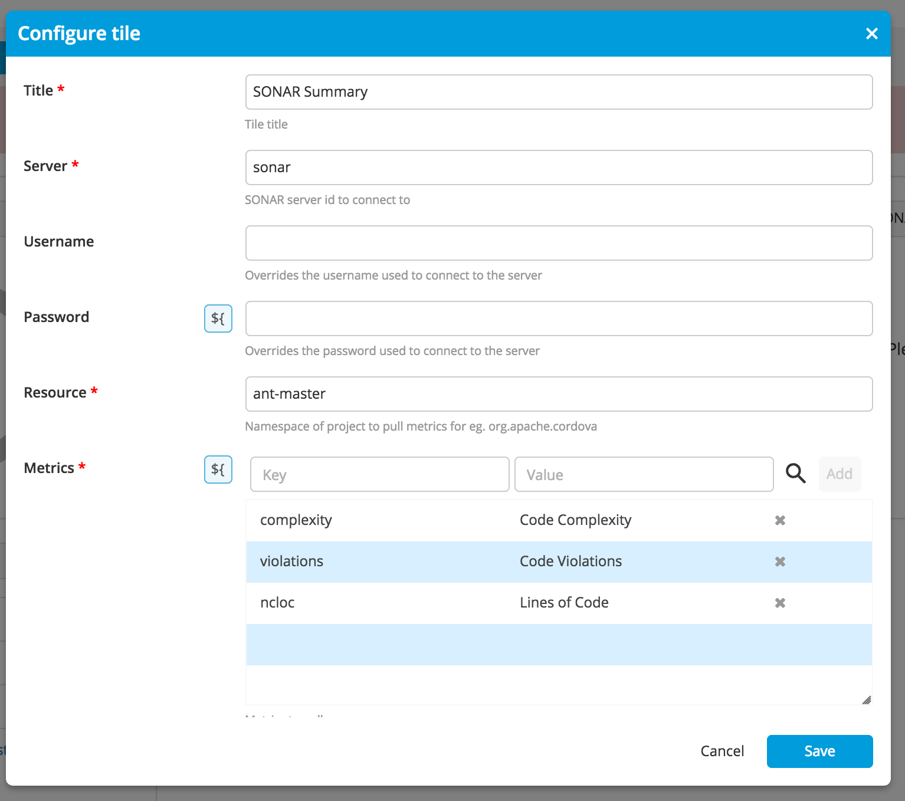
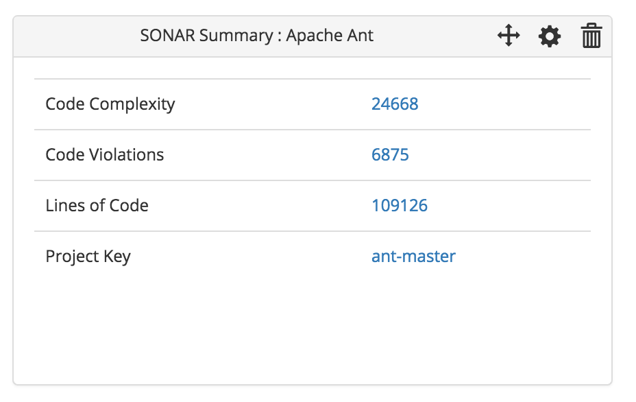

# XL Release Sonar Plugin
Sonar Tile for XL Release


## CI status ##

[![Build Status][xlr-sonar-plugin-travis-image] ][xlr-sonar-plugin-travis-url]
[![Codacy Badge][xlr-sonar-plugin-codacy-image] ][xlr-sonar-plugin-codacy-url]
[![Code Climate][xlr-sonar-plugin-code-climate-image] ][xlr-sonar-plugin-code-climate-url]
[![License: MIT][xlr-sonar-plugin-license-image] ][xlr-sonar-plugin-license-url]
[![Github All Releases][xlr-sonar-plugin-downloads-image] ]()

[xlr-sonar-plugin-travis-image]: https://travis-ci.org/xebialabs-community/xlr-sonar-plugin.svg?branch=master
[xlr-sonar-plugin-travis-url]: https://travis-ci.org/xebialabs-community/xlr-sonar-plugin
[xlr-sonar-plugin-codacy-image]: https://api.codacy.com/project/badge/Grade/fdf07d8c1af248fd95e795b9bbef921e
[xlr-sonar-plugin-codacy-url]: https://www.codacy.com/app/joris-dewinne/xlr-sonar-plugin
[xlr-sonar-plugin-code-climate-image]: https://codeclimate.com/github/xebialabs-community/xlr-sonar-plugin/badges/gpa.svg
[xlr-sonar-plugin-code-climate-url]: https://codeclimate.com/github/xebialabs-community/xlr-sonar-plugin
[xlr-sonar-plugin-license-image]: https://img.shields.io/badge/License-MIT-yellow.svg
[xlr-sonar-plugin-license-url]: https://opensource.org/licenses/MIT
[xlr-sonar-plugin-downloads-image]: https://img.shields.io/github/downloads/xebialabs-community/xlr-sonar-plugin/total.svg


## Installation ##

You can copy the pre build jar file from under the releases section under git repo

OR 

Build the project:
```
./gradlew assemble
```

Copy the extension to the plugins folder of your XLR installation:
```
cp ./build/libs/xlr-sonar-plugin-1.0.jar $XLRelease_HOME/plugins
```


## Usage ##

1. Go to the Settings > Configuration and define a Sonarqube Server Reference. eg https://builds.apache.org/analysis

2. Then go to a release template and go to the release summary view
3. Add the Sonar Tile from the drop down list. Provide a project id. eg. ant-master
4. Specify what all metrics you want to show in summary ( Keys are the key used as Sonar metrics URI params, Value part is a Nice to Show Header for that metric)


5. On saving, you'll get the Preview. You can even click on the Data items represented as hyperlinks that take you back to the Sonar Dashboard in a separate browser. 

